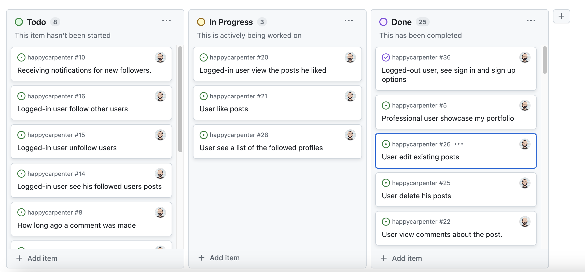

# [HAPPYCARPENTER](https://happy-carpenter-front-26472ba73a7c.herokuapp.com)

[](https://github.com/ibra8080/happy-carpenter-front/commits/main)
[](https://github.com/ibra8080/happy-carpenter-front/commits/main)
[](https://github.com/ibra8080/happy-carpenter-front)


source: [amiresponsive](https://ui.dev/amiresponsive?url=https://happy-carpenter-front-26472ba73a7c.herokuapp.com)

Happy Carpenter is a community website for woodworking enthusiasts and professionals. It provides a platform for users to connect, share their projects, offer services, and arrange collaborations within the woodworking community.


## Project Overview

Happy Carpenter consists of two main components:

1. Backend API: Developed using Django Rest Framework
   - Repository: [Happy Carpenter API](https://github.com/ibra8080/happycarpenter)
   - Deployed at: [Here](https://happy-carpenter-ebf6de9467cb.herokuapp.com/)

2. Frontend Application: Built with React
   - Repository: [Happy Carpenter Frontend](https://github.com/ibra8080/happy-carpenter-front)
   - Deployed at: [Here](https://happy-carpenter-front-26472ba73a7c.herokuapp.com/)

This README focuses on the frontend application, detailing its features, setup, and usage.

## UX

### Colour Scheme

The colour scheme for Happy Carpenter is designed to evoke warmth, professionalism, and a connection to woodworking. The following colors were chosen:

- `#D69723` (Gold) used for primary highlights, representing the warmth of wood and craftsmanship.
- `#a60d0d` (Deep Red) used for secondary highlights, adding a touch of elegance and contrast.
- `#3f3f3f` (Dark Gray) used for primary text, ensuring readability and a professional look.
- `#fffcec` (Off-White) used for the background, providing a soft, warm backdrop that doesn't strain the eyes.

I used [coolors.co](https://coolors.co/d69723-a60d0d-3f3f3f-fffcec) to generate my colour palette.


These colors are defined as CSS variables for easy maintenance and consistency across the site:

```css
:root {
    --primary-color: #a60d0d;
    --secondary-color: #D69723;
    --text-color: #3f3f3f;
    --background-color: #fffcec;
}
```

### Typography

The primary font used throughout the Happy Carpenter website is Poppins. This modern, geometric sans-serif typeface offers excellent readability and a clean, professional look that aligns well with the site's woodworking theme.

- [Poppins](https://fonts.googleapis.com/css2?family=Poppins) is used for all text on the site, with various weights to create hierarchy and emphasis.

The font is imported in the HTML using the following Google Fonts link:

```html
<link href="https://fonts.googleapis.com/css2?family=Poppins:ital,wght@0,100;0,200;0,300;0,400;0,500;0,600;0,700;0,800;0,900;1,100;1,200;1,300;1,400;1,500;1,600;1,700;1,800;1,900&display=swap" rel="stylesheet">
```
### Logo and Imagery

The Happy Carpenter logo features a stylized carpenter's hammer icon, symbolizing the craft and skills central to woodworking. The logo is designed to be simple yet memorable, effectively representing the brand across various media.


The logo is available in different versions to suit various applications:

- Primary logo (full color)
- Icon-only version (for favicons and small applications)
- Typographic version (for text-only contexts)


### User Stories

1. As a user, I can view a navbar from every page so that I can navigate easily between pages.
2. As a logged-out user, I can see sign-in and sign-up options so that I can sign in/sign up.
3. As a user, I can create an account to access all features of the application.
4. As a logged-in user, I can easily log out to ensure the security of my account.
5. As a user, I can tell if I am logged in or not so that I can log in if I need to.
6. As a user, I can view other users' profiles to learn more about them and their work.
7. As a user, I can view users' avatars so that I can easily identify users of the application.
8. As a logged-in user, I can create posts to share my woodworking projects.
9. As a user, I can view all posts to see the latest content from the community.
10. As a logged-in user, I can like posts to show appreciation for other users' work.
11. As a logged-in user, I can comment on posts to engage with the community.
12. As a logged-in user, I can edit my own posts and comments to update or correct information.
13. As a user, I can search and filter posts to find specific content I'm interested in.
14. As a professional user, I can create ads to offer my woodworking services.
15. As a user, I can view ads to find woodworking services or opportunities.

### User Goals

#### Amateur Woodworkers
- Share their projects and get feedback from the community
- Learn from more experienced woodworkers
- Find inspiration for new projects

#### Professional Woodworkers
- Showcase their portfolio of work
- Offer services and attract potential clients
- Network with other professionals in the field

#### General Users
- Explore woodworking projects and techniques
- Connect with woodworking enthusiasts
- Find custom woodworking services


To follow best practice, wireframes were developed for mobile, tablet, and desktop sizes.
I've used [Figma](https://figma.com) to design my site wireframes.

### Mobile Wireframes

<details>
<summary> Click here to see the Mobile Wireframes </summary>

Home
  - 

Profile
  - 

</details>

### Desktop Wireframes

<details>
<summary> Click here to see the Desktop Wireframes </summary>
Home
  - 

Profile
  - 

</details>

## Features

### Existing Features

- **Navigation Bar**

    - The navigation bar is present on all pages, providing easy access to different sections of the site.
    - It includes the Happy Carpenter logo, main navigation links, and user authentication options.
    - The navbar is fully responsive, collapsing into a hamburger menu on smaller screens for better mobile usability.
    - This feature ensures that users can navigate the site efficiently, enhancing overall user experience.


- **User Authentication**

    - Users can sign up for new accounts, log in to existing accounts, and securely log out.
    - This feature allows users to have personalized experiences, manage their own content, and interact with the community.
    - The authentication system ensures data privacy and enables features like posting projects and following other users.


- **Post Creation and Interaction**

    - Users can create posts to share their woodworking projects, including images and descriptions.
    - The community can interact with posts through likes and comments, fostering engagement and discussion.
    - Post owners have the ability to edit or delete their own posts, giving them control over their content.
    - This feature is central to the platform, allowing users to showcase their work and learn from others.


- **User Profiles**

    - Each user has a profile page displaying their information and posted content.
    - Users can edit their profiles, updating information and profile pictures.
    - The follow/unfollow feature allows users to connect with each other and curate their feed.
    - Profiles help build a sense of community and allow users to showcase their woodworking journey.


- **Professional Accounts**

    - Users can identify as professional woodworkers, unlocking additional features.
    - Enhanced profiles for professionals showcase their skills, experience, and services.
    - Clients can leave reviews and ratings for professionals, building trust in the community.
    - Professionals can receive job offers through the platform, creating business opportunities.
    - This feature adds value for skilled woodworkers and clients looking for professional services.


- **Search and Filter**

    - Users can search for specific content or users across the platform.
    - Posts can be filtered by category or user preference, allowing for customized browsing.
    - This feature helps users find relevant content quickly, enhancing the user experience.


- **Responsive Design**

    - The entire application is responsive, providing a seamless experience across desktop, tablet, and mobile devices.
    - This ensures that users can access and enjoy the platform regardless of their device, increasing accessibility and user satisfaction.


### Future Features

- Messaging system for direct user communication
- Geolocation integration for localized service matching
- Professionals can advertise their work through featured listings or sponsored content
- Users can follow each other to stay updated on specific woodworkers' activities

## Tools & Technologies Used

- [](https://tim.2bn.dev/markdown-builder) used to generate README and TESTING templates.
- [](https://git-scm.com) used for version control. (`git add`, `git commit`, `git push`)
- [](https://github.com) used for secure online code storage.
- ⚠️⚠️ IDE: CHOOSE ONLY ONE <-- delete me ⚠️⚠️
- [](https://gitpod.io) used as a cloud-based IDE for development.
- [](https://en.wikipedia.org/wiki/HTML) used for the main site content.
- [](https://en.wikipedia.org/wiki/CSS) used for the main site design and layout.
- [](https://www.javascript.com) used for user interaction on the site.
- [](https://jquery.com) used for user interaction on the site.
- [](https://www.heroku.com) used for hosting the deployed back-end site.
- [](https://getbootstrap.com) used as the front-end CSS framework for modern responsiveness and pre-built components.
- [](https://jestjs.io) used for automated JavaScript testing.
- [](https://dbs.ci-dbs.net) used as the Postgres database from Code Institute.
- [](https://cloudinary.com) used for online static file storage.
- [](https://www.figma.com) used for creating wireframes.
- [](https://fontawesome.com) used for the icons.
- [](https://chat.openai.com) used to help debug, troubleshoot, and explain things.


## Agile Development Process

### GitHub Projects

[GitHub Projects](https://github.com/ibra8080/happycarpenter/projects) served as an Agile tool for this project.
It isn't a specialized tool, but with the right tags and project creation/issue assignments, it can be made to work.

Through it, user stories, issues, and milestone tasks were planned, then tracked on a weekly basis using the basic Kanban board.



### GitHub Issues

[GitHub Issues](https://github.com/ibra8080/happycarpenter/issues) served as an another Agile tool.
There, I used my own **User Story Template** to manage user stories.

It also helped with milestone iterations on a weekly basis.


- [Open Issues](https://github.com/ibra8080/happycarpenter/issues) [](https://github.com/ibra8080/happycarpenter/issues)

    

- [Closed Issues](https://github.com/ibra8080/happycarpenter/issues?q=is%3Aissue+is%3Aclosed) [](https://github.com/ibra8080/happycarpenter/issues?q=is%3Aissue+is%3Aclosed)

    

### MoSCoW Prioritization

I've decomposed my Epics into stories prior to prioritizing and implementing them.
Using this approach, I was able to apply the MoSCow prioritization and labels to my user stories within the Issues tab.

- **Must Have**: guaranteed to be delivered (*max 60% of stories*)
- **Should Have**: adds significant value, but not vital (*the rest ~20% of stories*)
- **Could Have**: has small impact if left out (*20% of stories*)
- **Won't Have**: not a priority for this iteration

## Testing

> [!NOTE]  
> For all testing, please refer to the [TESTING.md](TESTING.md) file.

## Deployment

The live deployed application can be found deployed on [Heroku](https://happy-carpenter-front-26472ba73a7c.herokuapp.com).

### PostgreSQL Database

This project uses a [Code Institute PostgreSQL Database](https://dbs.ci-dbs.net).

To obtain my own Postgres Database from Code Institute, I followed these steps:

- Signed-in to the CI LMS using my email address.
- An email was sent to me with my new Postgres Database.

> [!CAUTION]  
> - PostgreSQL databases by Code Institute are only available to CI Students.
> - You must acquire your own PostgreSQL database through some other method
> if you plan to clone/fork this repository.
> - Code Institute students are allowed a maximum of 8 databases.
> - Databases are subject to deletion after 18 months.

### Cloudinary API

This project uses the [Cloudinary API](https://cloudinary.com) to store media assets online, due to the fact that Heroku doesn't persist this type of data.

To obtain your own Cloudinary API key, create an account and log in.

- For *Primary interest*, you can choose *Programmable Media for image and video API*.
- Optional: *edit your assigned cloud name to something more memorable*.
- On your Cloudinary Dashboard, you can copy your **API Environment Variable**.
- Be sure to remove the `CLOUDINARY_URL=` as part of the API **value**; this is the **key**.

### Heroku Deployment

This project is deployed on [Heroku](https://www.heroku.com), a platform as a service (PaaS) that enables developers to build, run, and operate applications entirely in the cloud.

Deployment steps are as follows, after account setup:

1. Log in to Heroku and select "Create new app" from the dropdown menu in the top right.
2. Choose a unique name for your app and select the region closest to you.
3. Go to the "Deploy" tab and select "GitHub" as the deployment method.
4. Find your repository and connect it to Heroku.
5. In the "Manual deploy" section, click "Deploy Branch" to deploy your main branch.

For automatic deploys:

- You can enable automatic deploys in the "Automatic deploys" section. This will deploy your app every time you push to the selected branch on GitHub.

Heroku specific files:

- For a React app, you don't typically need additional files like `Procfile` or `requirements.txt`.
- However, you do need to ensure your `package.json` file includes a start script:

```json
"scripts": {
  "start": "react-scripts start"
}
```

### Local Deployment

This project can be cloned or forked in order to make a local copy on your own system.

#### Cloning

You can clone the repository by following these steps:

1. Go to the [GitHub repository](https://github.com/ibra8080/happy-carpenter-front) 
2. Locate the Code button above the list of files and click it 
3. Select if you prefer to clone using HTTPS, SSH, or GitHub CLI and click the copy button to copy the URL to your clipboard
4. Open Git Bash or Terminal
5. Change the current working directory to the one where you want the cloned directory
6. In your IDE Terminal, type the following command to clone my repository:
	- `git clone https://github.com/ibra8080/happy-carpenter-front.git`
7. Press Enter to create your local clone.

#### Forking

By forking the GitHub Repository, we make a copy of the original repository on our GitHub account to view and/or make changes without affecting the original owner's repository.
You can fork this repository by using the following steps:

1. Log in to GitHub and locate the [GitHub Repository](https://github.com/ibra8080/happy-carpenter-front)
2. At the top of the Repository (not top of page) just above the "Settings" Button on the menu, locate the "Fork" Button.
3. Once clicked, you should now have a copy of the original repository in your own GitHub account!

### Local Development

After cloning or forking the repository, you need to take the following steps to run the project locally:

1. Install dependencies:
npm install
2. Create a `.env` file in the root directory and add any necessary environment variables. For example:
REACT_APP_API_URL=https://your-backend-api-url.com
3. Start the development server:
npm start

4. Open [http://localhost:3000](http://localhost:3000) to view it in the browser.

### Available Scripts

In the project directory, you can run:

- `npm start`: Runs the app in the development mode.
- `npm test`: Launches the test runner in the interactive watch mode.
- `npm run build`: Builds the app for production to the `build` folder.
- `npm run eject`: Removes the single build dependency from your project.

**Note: The `eject` script is a one-way operation. Once you eject, you can't go back!**

### Local VS Deployment

I have not noticed any significant differences between the local version of the Happy Carpenter frontend and the live deployment on Heroku. The application's functionality, appearance, and performance remain consistent across both environments.

## Credits

### Content

| Source | Location | Notes |
| --- | --- | --- |
| [Markdown Builder](https://tim.2bn.dev/markdown-builder) | README and TESTING | tool to help generate the Markdown files |
| [W3Schools](https://www.w3schools.com/howto/howto_js_topnav_responsive.asp) | entire site | responsive HTML/CSS/JS navbar |
| [YouTube](https://www.youtube.com/watch?v=p8nOfP2fw24&list=PLQtNtS-WfRa9LbmD8ON7rWhn-AtKTGdkn) | leaderboard | React |
| [WhiteNoise](http://whitenoise.evans.io) | entire site | hosting static files on Heroku temporarily |

### Media

| Source | Location | Type | Notes |
| --- | --- | --- | --- |
| [Pexels](https://www.pexels.com) | entire site | image | favicon on all pages |
| [TinyPNG](https://tinypng.com) | entire site | image | tool for image compression |

### Acknowledgements

- I would like to thank the [Code Institute](https://codeinstitute.net) tutor team for their assistance with troubleshooting and debugging some project issues.
- I would like to thank the [Code Institute Slack community](https://code-institute-room.slack.com) for the moral support; it kept me going during periods of self doubt and imposter syndrome.
