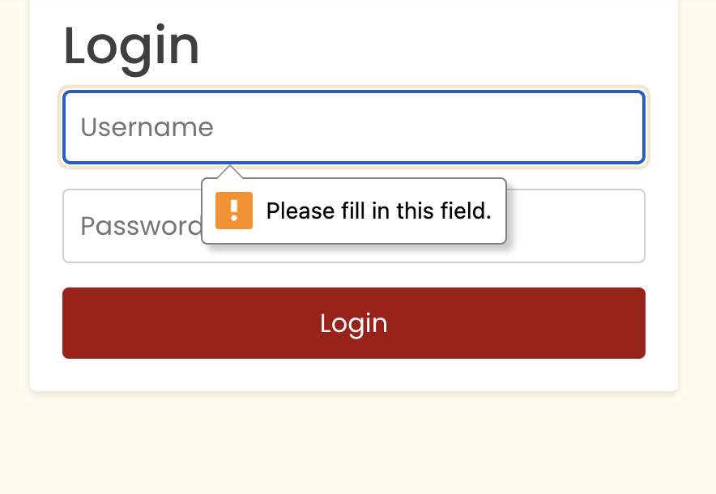

# Testing

> [!NOTE]  
> Return back to the [README.md](README.md) file.

## Code Validation

### HTML

I have used the recommended [HTML W3C Validator](https://validator.w3.org) to validate all of my HTML files.

| Page | Screenshot | Notes |
| ---  | --- | --- |
| Home  |  | |
| Profile  |  | |

### CSS

I have used the recommended [CSS Jigsaw Validator](https://jigsaw.w3.org/css-validator) to validate all of my CSS files.

| Page  | Screenshot | Notes |
| ---  | --- | --- |
| Home |  | |
| Profile |  | |

## Browser Compatibility

I've tested my deployed project on multiple browsers to check for compatibility issues.

| Browser | Home | profile | Posts  | Note
| --- | --- | --- | --- | --- |
| Chrome |  |  |   | Works as expected |
| Firefox |  |  |  | Works as expected |
| Safari |  |  |  | Works as expected |

## Responsiveness

I've tested my deployed project on multiple devices to check for responsiveness issues.

| Device | Home | Profile | Posts | Notes |
| --- | --- | --- | --- | --- |
| Mobile (DevTools) |  |  |  | Works as expected |
| Tablet (DevTools) |   |  |  | Works as expected |
| Desktop |  |  |  | Works as expected |

## Lighthouse Audit

I've tested my deployed project using the Lighthouse Audit tool to check accessibility.

| Page | Mobile | Desktop | Notes |
| --- | --- | --- | --- |
| Home |  |  | Some minor warnings |
| Profile |  |  | Slow response time due to large images |

## Defensive Programming

Defensive programming was manually tested with the below user acceptance testing:

| Page | Expectation | Test | Result | Fix | Screenshot |
| --- | --- | --- | --- | --- | --- |
| Sign in | | | | | |
| | Users should not be able to submit an empty form | Attempted to submit form with empty fields | Form submission was prevented and error messages were displayed | Test concluded and passed |  |
| | Users should see an error message for incorrect credentials | Entered incorrect username/password | An error message was displayed indicating invalid credentials | Test concluded and passed |  |
| Sign up | | | | | |
| | Users should not be able to sign up with a username that already exists | Attempted to create an account with an existing username | An error message was displayed indicating the username is taken | Test concluded and passed |  |
| | Passwords should be required to match | Entered mismatching passwords in the password and confirm password fields | An error message was displayed indicating passwords do not match | Test concluded and passed |  |
| Create Post | | | | | |
| | Users should not be able to create a post with an image larger than 2 MB| Attempted to submit a post with an larg image | Form submission was prevented and an error message was displayed | Test concluded and passed |  |

## User Story Testing

| User Story | Screenshot |
| --- | --- |
| As a new site user, I want to register for an account, so that I can access the platform's features. |  |
| As a returning site user, I want to log in to my account, so that I can access my personalized content and interactions. |  |
| As a user, I want to create a new post with a photo and description, so that I can share my woodworking projects with the community. |  |
| As a user, I want to view the details of a specific post, so that I can get more information about a project and engage with it. |  |
| As a user, I want to like posts to show my appreciation for other users' work. |  |
| As a logged-in user, I want to add comments to a post, so that I can share my thoughts and engage in discussions about the projects. |  |

## Bugs
**Bugs**

* JS Uncaught ReferenceError: 400 (Bad Request)

   * To fix this, I need to review the registration form submission process, particularly the email field which seems to be causing an issue. The backend is reporting that the email field may not be blank.

   

* JS `'token_not_valid'` error when trying to access user data

   * To fix this, I need to implement proper token refresh logic in the frontend. The current access token is not valid, which could be due to expiration or improper storage/retrieval.

   

* Form submission issues in the registration process

   * To fix this, I need to ensure all required fields are properly filled out before submission. The registration form should validate all fields, including email, before sending the request to the backend.

   

* User authentication state not properly maintained

   * To fix this, I need to implement proper state management for user authentication. After successful login, the user's authenticated state should be maintained and reflected in the UI (as seen in the navbar with the user's name and avatar).

   

* Responsive design issues on mobile devices

   * To fix this, I need to review and adjust the CSS for mobile views. The registration form appears to be cut off on smaller screens, indicating a need for better responsive design implementation.

   

**Bugs**

* JS Error: Request failed with status code 404 on sign-in attempt

   * To fix this, I need to verify the API endpoint for sign-in is correct and accessible. The 404 error suggests the endpoint might not exist or the server is not responding as expected.

   

* Error fetching profile: Request failed with status code 500

   * To fix this, I need to investigate the server-side error causing the 500 status. This could be due to incorrect data handling, database issues, or other server-side problems.

   

* Console warnings about Avatar src

   * To fix this, I need to ensure that all avatar image URLs are valid and accessible. The console shows multiple warnings about Avatar src, which might indicate broken image links or incorrect URL formatting.

   

* Authentication state inconsistency

   * To fix this, I need to implement proper state management for user authentication. The console shows conflicting messages about the user's auth status.

   

* Login Forbidden Error: POST request to login endpoint returns 403 status

   * To fix this, I need to investigate why the server is forbidding access to the login endpoint. This could be due to CORS issues, incorrect API credentials, or server-side authentication problems.

   

## Unfixed Bugs

### Unfixed Bugs

- User needs to manually refresh the home page after signing in to see the signed-in version of the home page.

    - Attempted fix: I tried implementing automatic redirection after sign-in, but it led to issues with state management. A more robust solution involving React Router and global state management is needed.

- Like functionality is inconsistent and doesn't always update correctly.

    - Attempted fix: I've tried updating the state locally after a like action, but it sometimes gets out of sync with the backend. A real-time update mechanism or optimistic UI updates might resolve this issue.

> [!NOTE]  
> There are no remaining bugs that I am aware of.
