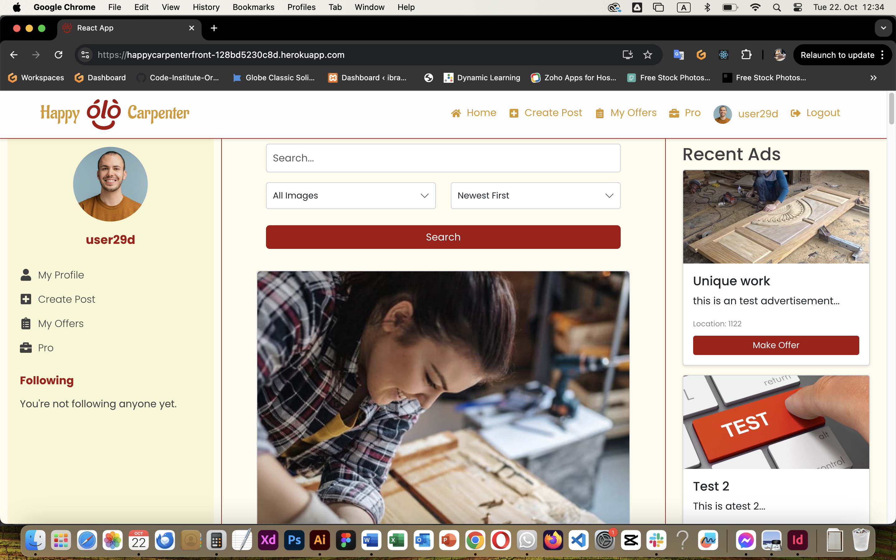

# Testing

> [!NOTE]  
> Return back to the [README.md](README.md) file.

## Code Validation

### HTML

I have used the recommended [HTML W3C Validator](https://validator.w3.org) to validate all of my HTML files.

| Page | Screenshot | Notes |
| ---  | --- | --- |
| Home  |  | |
| Profile  |  | |

### CSS

I have used the recommended [CSS Jigsaw Validator](https://jigsaw.w3.org/css-validator) to validate all of my CSS files.

| Page  | Screenshot | Notes |
| ---  | --- | --- |
| Home |  | |
| Profile |  | |

## Browser Compatibility

I've tested my deployed project on multiple browsers to check for compatibility issues.

| Browser | Home | profile | Posts  | Note
| --- | --- | --- | --- | --- |
| Chrome |  |  |   | Works as expected |
| Firefox |  |  |  | Works as expected |
| Safari |  |  |  | Works as expected |

## Responsiveness

I've tested my deployed project on multiple devices to check for responsiveness issues.

| Device | Home | Profile | Posts | Notes |
| --- | --- | --- | --- | --- |
| Mobile (DevTools) |  |  |  | Works as expected |
| Tablet (DevTools) |   |  |  | Works as expected |
| Desktop |  |  |  | Works as expected |

## Lighthouse Audit

I've tested my deployed project using the Lighthouse Audit tool to check accessibility.

| Page | Mobile | Desktop | Notes |
| --- | --- | --- | --- |
| Home |  |  | Some minor warnings |
| Profile |  |  | Slow response time due to large images |

## Defensive Programming

Defensive programming was manually tested with the below user acceptance testing:

| Page | Expectation | Test | Result | Fix | Screenshot |
| --- | --- | --- | --- | --- | --- |
| Sign in | | | | | |
| | Users should not be able to submit an empty form | Attempted to submit form with empty fields | Form submission was prevented and error messages were displayed | Test concluded and passed |  |
| | Users should see an error message for incorrect credentials | Entered incorrect username/password | An error message was displayed indicating invalid credentials | Test concluded and passed |  |
| Sign up | | | | | |
| | Users should not be able to sign up with a username that already exists | Attempted to create an account with an existing username | An error message was displayed indicating the username is taken | Test concluded and passed |  |
| | Passwords should be required to match | Entered mismatching passwords in the password and confirm password fields | An error message was displayed indicating passwords do not match | Test concluded and passed |  |
| Create Post | | | | | |
| | Users should not be able to create a post with an image larger than 2 MB| Attempted to submit a post with an larg image | Form submission was prevented and an error message was displayed | Test concluded and passed |  |

## User Story Testing

| User Story | Screenshot |
| --- | --- |
| As a new site user, I want to register for an account, so that I can access the platform's features. |  |
| As a returning site user, I want to log in to my account, so that I can access my personalized content and interactions. |  |
| As a user, I want to create a new post with a photo and description, so that I can share my woodworking projects with the community. |  |
| As a user, I want to view the details of a specific post, so that I can get more information about a project and engage with it. |  |
| As a user, I want to like posts to show my appreciation for other users' work. |  |
| As a logged-in user, I want to add comments to a post, so that I can share my thoughts and engage in discussions about the projects. |  |

## Bugs
**Bugs**

* Follow Status Update Error: 401 (Unauthorized)

  * The follow/unfollow functionality was failing with a 401 error when trying to update follow status. Looking at the network tab, the issue was related to token expiration and authorization headers not being properly set for the request.
  * To fix this, I implemented proper token refresh handling in the authService and updated the follow action to include the correct authorization headers.

  

* Invalid Professional ID or Advertisement ID Error: 400 (Bad Request)

  * When attempting to create a job offer, the system was failing to properly pass the professional ID and advertisement ID to the backend. The error occurred because the IDs were not being correctly extracted from the URL parameters.
  * Fixed by updating the JobOfferForm component to correctly parse and handle URL parameters, and ensuring the backend validation was properly checking for these required fields.

  

* Multiple Failed Like Requests: 401 (Unauthorized)

  * Multiple simultaneous like requests were failing with 401 errors. The network tab showed multiple failed XHR requests to the likes endpoint for different posts.
  * The solution involved implementing proper request debouncing and fixing the authorization token handling in the likeService to prevent multiple failed requests.

  

* Categories Map TypeError: Runtime Error

  * A runtime error occurred when trying to map over categories in the PostForm component. The error "categories.map is not a function" indicated that the categories data structure wasn't properly initialized.
  * Fixed by ensuring the categories state was properly initialized as an array and handling the case where categories data might be null or undefined.

  

* Network Error on Post Creation: ERR_NETWORK

  * Post creation was failing with a network error. The console showed an Axios error with "ERR_NETWORK" when attempting to create a new post with an image.
  * The fix involved properly configuring the multipart/form-data content type headers and ensuring the image upload was correctly handled in the form submission process.

  
  

## Unfixed Bugs
  
> There are no remaining bugs that I am aware of.
